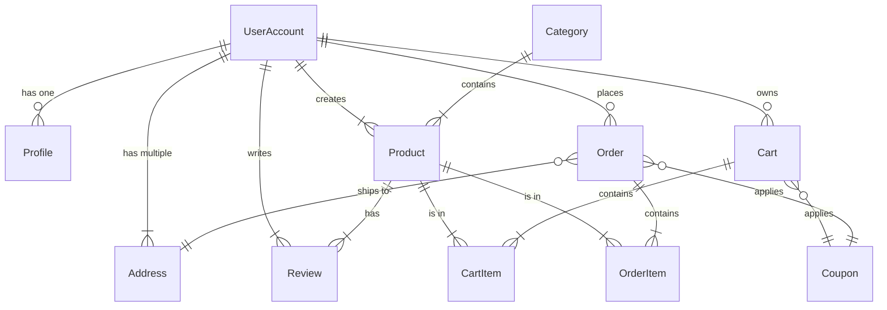

# Database ERD (Entity-Relationship Diagram)

This document provides an Entity-Relationship Diagram (ERD) for the core models of the Hypex E-commerce API. It illustrates the relationships between the main entities in the database.

## Key Relationships Explained

-   **UserAccount**: The central model for users. It has one-to-many relationships with `Address`, `Product`, `Review`, `Cart`, and `Order`. It also has a one-to-one relationship with `Profile`.
-   **Category & Product**: A `Category` can have multiple `Product`s, but each `Product` belongs to a single `Category`. This is a one-to-many relationship.
-   **Product & Review**: A `Product` can have multiple `Review`s, and each `Review` is written by a single `UserAccount`.
-   **Cart & CartItem**: The `Cart` model holds a collection of `CartItem`s. Each `CartItem` links a `Product` with a specific quantity to a `Cart`.
-   **Order & OrderItem**: Similar to the cart, an `Order` is composed of multiple `OrderItem`s. Each `OrderItem` represents a `Product` that was part of the purchase.
-   **Coupon**: Coupons can be applied to both `Cart`s and `Order`s, creating an optional one-to-one relationship.
-   **Address**: An `Order` is associated with a specific shipping `Address` belonging to a `UserAccount`.
