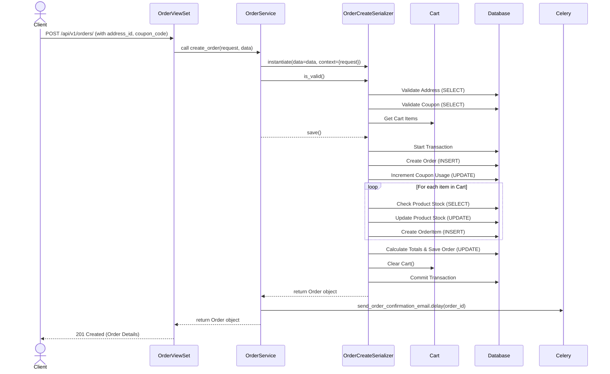

# Order Creation Sequence Diagram

This diagram shows the sequence of events that occur when a user creates a new order from their shopping cart.

## Sequence Breakdown

1.  **Request Initiation**: The client sends a `POST` request to the `/api/v1/orders/` endpoint, providing the shipping address ID and an optional coupon code.
2.  **View Layer**: The `OrderViewSet` receives the request and delegates the creation logic to the `OrderService`.
3.  **Service Layer**: The `OrderService` uses the `OrderCreateSerializer` to handle the complex logic of order creation.
4.  **Validation**: The `OrderCreateSerializer` performs several validation checks:
    -   It verifies that the provided `address_id` exists and belongs to the current user.
    -   It checks if the `coupon_code` is valid, active, and meets all usage criteria.
    -   It ensures the user's `Cart` is not empty.
5.  **Database Transaction**: To ensure data integrity, the entire creation process is wrapped in a database transaction (`transaction.atomic`). If any step fails, all changes are rolled back.
6.  **Order Creation**:
    -   A new `Order` record is created in the database.
    -   If a coupon was used, its usage count is incremented.
7.  **Order Item Processing**: The serializer iterates through each item in the user's cart:
    -   It checks if there is sufficient `stock` for the `Product`.
    -   It decrements the product's stock level.
    -   It creates a corresponding `OrderItem` linked to the new `Order`.
8.  **Finalization**:
    -   Shipping costs and taxes are calculated and added to the order.
    -   The final `total_payable` amount is calculated and the `Order` is updated.
    -   The user's `Cart` is cleared.
9.  **Transaction Commit**: If all steps are successful, the database transaction is committed.
10. **Asynchronous Task**: The `OrderService` dispatches a Celery task (`send_order_confirmation_email`) to send a confirmation email to the user without blocking the API response.
11. **Response**: The `OrderViewSet` returns a `201 Created` status with the details of the newly created order.
